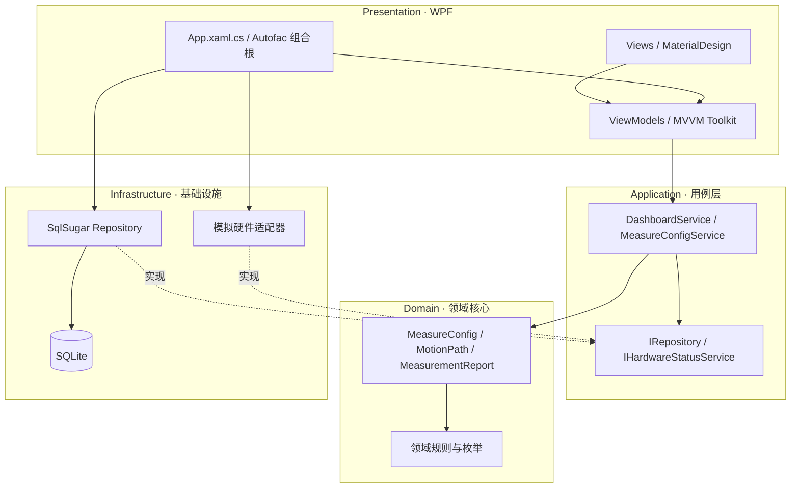
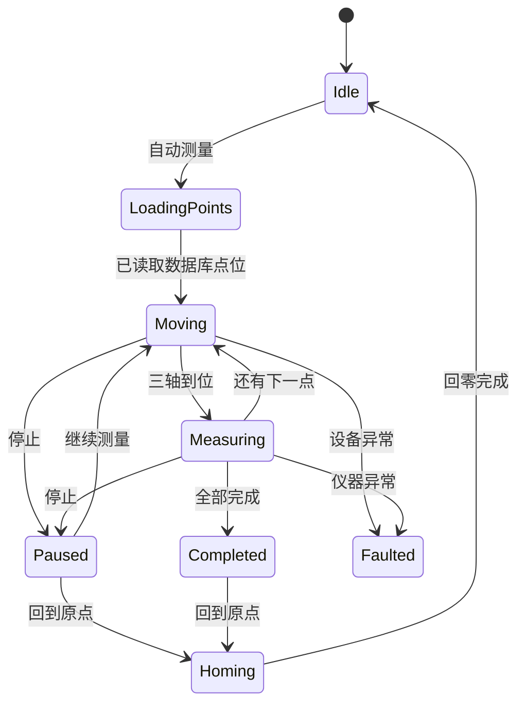

# AMP Clean Architecture WPF

项目使用 .NET 8、SqlSugar、Autofac、CommunityToolkit.Mvvm 与 MaterialDesignThemes，默认通过 SQLite 保存演示数据。

## 架构结构图



依赖规则是：源码依赖只能指向内层。`Domain` 不知道数据库和 WPF；`Application` 只声明端口；`Infrastructure` 实现端口；`Presentation` 是最外层，并在唯一的组合根中用 Autofac 连接接口和实现。

## 目录结构

```text
Clean Architectureach/
├─ AmpCleanArchitecture.sln
├─ Directory.Build.props
├─ README.md
├─ src/
│  ├─ AmpClean.Domain/             # 实体、枚举、领域规则（零第三方依赖）
│  ├─ AmpClean.Application/        # 用例、DTO、仓储与硬件端口
│  ├─ AmpClean.Infrastructure/     # SqlSugar、SQLite、硬件适配器
│  └─ AmpClean.Presentation/       # WPF、MaterialDesign、MVVM、Autofac 组合根
└─ tests/
   └─ AmpClean.Application.Tests/  # 不启动 UI/数据库的快速测试
```


## 运行

```powershell
cd "E:\SQCX\Clean Architectureach"
dotnet restore AmpCleanArchitecture.sln
dotnet build AmpCleanArchitecture.sln
dotnet run --project src/AmpClean.Presentation
```

首次启动时会在程序输出目录的 `Data/amp-clean.db` 自动建表并写入一组演示数据。连接字符串位于 `src/AmpClean.Presentation/appsettings.json`。

## 继续接入真实 AMP 硬件

1. 在 `Infrastructure/Hardware` 新建 `MultiCardHardwareStatusService`，实现 `IHardwareStatusService`。
2. 把 AMP 的原生 DLL 以 `Content`/程序集引用方式放到 Infrastructure，不要放进 Domain 或 Application。
3. 在 `App.xaml.cs` 将 `SimulatedHardwareStatusService` 注册替换为真实实现。
4. 将测量流程拆成 Application 用例；UI 只调用命令并展示状态。

> 当前项目是架构骨架和可运行的 CRUD 样例，没有直接复制 AMP 的闭源/硬件 DLL、算法和完整计量流程。这样可以先稳定边界，再逐个迁移业务，避免把旧单体耦合一并带入新架构。

## 三轴自动测量模拟

“自动测量”页面使用数据库中的 `MeasurementPoint` 点位表驱动三轴模拟运动。默认移动到下一点需要 2 秒，到位后假仪器生成 8 个测量值；模拟平台的当前位置会写入 `SimulationAxisState` 表。



模拟时间可在 `src/AmpClean.Presentation/appsettings.json` 中调整：

```json
"Simulation": {
  "MoveIntervalMilliseconds": 2000,
  "MeasureDurationMilliseconds": 0
}
```

真实硬件接入时分别实现 `IMotionController` 和 `IMeasurementInstrument`，再替换 `App.xaml.cs` 中的 Autofac 注册即可；`MeasurementWorkflow` 状态机和 `MeasureViewModel` 不需要修改。

### 仪器校准与 RLS

进入“自动测量”页面时，`MeasureViewModel.InitializeAsync` 通过应用服务读取模拟仪器数据库中的 SVD 数据：

1. 将仪器校准实测矩阵展平显示到 `ReadDataList`。
2. 自动测量完成后，`MeasurementWorkflow` 将完整测量矩阵交给 `MeasurementCalibrationService`。
3. 应用服务读取数据库标准矩阵，执行 RLS，并通过仪器校准端口写回系数和误差指标。
4. ViewModel 只显示系数和状态，不包含矩阵构造、算法或数据库逻辑。

当前模拟数据库提供 8×8 的 SVD 矩阵和 8×3 的标准矩阵；八个点位测量完成后，RLS 输出 8×3 的系数矩阵并保存到 `InstrumentCalibrationRecord`。算法使用强类型 `RlsCalculationResult` 返回结果。
