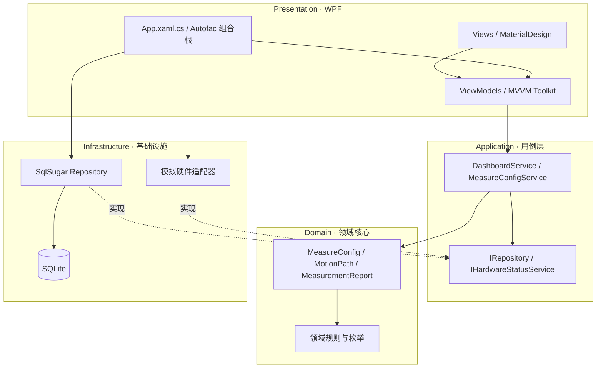

# AMP Clean Architecture WPF

这是参考 `E:\SQCX\sqcx-main\AMP` 业务概念创建的可运行 WPF 架构骨架。项目使用 .NET 8、SqlSugar、Autofac、CommunityToolkit.Mvvm 与 MaterialDesignThemes，默认通过 SQLite 保存演示数据。

## 架构结构图



依赖规则是：源码依赖只能指向内层。`Domain` 不知道数据库和 WPF；`Application` 只声明端口；`Infrastructure` 实现端口；`Presentation` 是最外层，并在唯一的组合根中用 Autofac 连接接口和实现。

## 目录结构

```text
Clean Architectureach/
├─ AmpCleanArchitecture.sln
├─ Directory.Build.props
├─ README.md
├─ src/
│  ├─ AmpClean.Domain/             # 实体、枚举、领域规则（零第三方依赖）
│  ├─ AmpClean.Application/        # 用例、DTO、仓储与硬件端口
│  ├─ AmpClean.Infrastructure/     # SqlSugar、SQLite、硬件适配器
│  └─ AmpClean.Presentation/       # WPF、MaterialDesign、MVVM、Autofac 组合根
└─ tests/
   └─ AmpClean.Application.Tests/  # 不启动 UI/数据库的快速测试
```

## AMP 业务映射

| 原 AMP 模块 | 新项目位置 | 说明 |
|---|---|---|
| `Entitys/MeasureConfig.cs` | `Domain/Entities/MeasureConfig.cs` | 去除 UI/ORM 耦合并加入领域校验 |
| `Entitys/MotionPath.cs` | `Domain/Entities/MotionPath.cs` | 为运动平台路径保留扩展点 |
| `Entitys/ReportInfo.cs` | `Domain/Entities/MeasurementReport.cs` | 提供报告查询示范 |
| `DataBase/*` | `Infrastructure/Persistence/*` | 统一由 SqlSugar 仓储实现 |
| `MotionPlatform/*` | `Application` 端口 + `Infrastructure` 适配器 | 隔离厂商 DLL |
| `ViewModels/*` | `Presentation/ViewModels/*` | 使用 CommunityToolkit.Mvvm |

## 运行

```powershell
cd "E:\SQCX\Clean Architectureach"
dotnet restore AmpCleanArchitecture.sln
dotnet build AmpCleanArchitecture.sln
dotnet run --project src/AmpClean.Presentation
```

首次启动时会在程序输出目录的 `Data/amp-clean.db` 自动建表并写入一组演示数据。连接字符串位于 `src/AmpClean.Presentation/appsettings.json`。

## 继续接入真实 AMP 硬件

1. 在 `Infrastructure/Hardware` 新建 `MultiCardHardwareStatusService`，实现 `IHardwareStatusService`。
2. 把 AMP 的原生 DLL 以 `Content`/程序集引用方式放到 Infrastructure，不要放进 Domain 或 Application。
3. 在 `App.xaml.cs` 将 `SimulatedHardwareStatusService` 注册替换为真实实现。
4. 将测量流程拆成 Application 用例；UI 只调用命令并展示状态。

> 当前项目是架构骨架和可运行的 CRUD 样例，没有直接复制 AMP 的闭源/硬件 DLL、算法和完整计量流程。这样可以先稳定边界，再逐个迁移业务，避免把旧单体耦合一并带入新架构。
